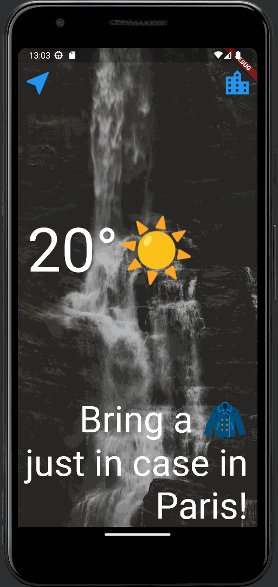

# Clima

Application de Météo.

Ce projet est issu d'une [formation](https://www.udemy.com/course/flutter-bootcamp-with-dart/) complete sur udemy dispensée par Angela Yu.

Je suis cette formation en vue d'un stage en mai sur Flutter.

# Eléments travaillés

- localisation (et autorisations)
- plugin Geolocator
- Async / Await / Future
- initState
- deactivate
- operateur `??`
- try / catch
- Navigator push with data
- Navigator pop with data
- Loading Spinner
- Api fetch

# Materiel

- Flutter
- Android Studio
- Tablette Lenovo M-10 / Android 10
- Emulateur Pixel 3a / Android 13

# Ressources

- [Udemy / Angela Yu](https://www.udemy.com/course/flutter-bootcamp-with-dart/)
- [Doc Flutter Widget](https://docs.flutter.dev/ui/widgets)

# Fichiers principaux

- Main : [lib/main.dart](lib/main.dart)
- Utilities : [lib/utilities/](lib/utilities)
- Services : [lib/services/](lib/services)
- Pages : [lib/screens/](lib/screens)

# Example

